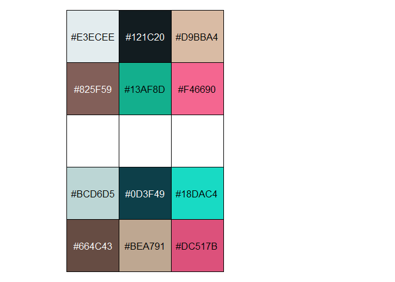

<!-- README.md is generated from README.Rmd. Please edit that file -->

# First Take Palettes

This package provides color palettes based on Sony’s [THE FIRST
TAKE](https://www.youtube.com/channel/UC9zY_E8mcAo_Oq772LEZq8Q) video
series. This package is not affiliated with Sony whatsoever.

ftpalsというパッケージのことはソニーやTHE FIRST TAKEに付属していません。

I made this as a side project to learn more about working with colors in
R. Specifically I wanted to do the following:

-   Learn more about working with image data in R (but.. not using
    magick)
-   Try to use clustering as a means to make color palettes
-   Try to make those color palettes color blind friendly procedurally

The first goal was accomplished via kmeans clustering, the second was
done by replicating the genetic algortihm implementation in this paper:

[Troiano, Luigi & Birtolo, Cosimo & Miranda, Maria. (2008). Adapting
palettes to color vision deficiencies by genetic algorithm. GECCO’08:
Proceedings of the 10th Annual Conference on Genetic and Evolutionary
Computation 2008. 1065-1072.
10.1145/1389095.1389291.](https://www.researchgate.net/publication/220740835_Adapting_palettes_to_color_vision_deficiencies_by_genetic_algorithm)

As a result I learned about genetic algorithms using the `GA` package:

[Luca Scrucca (2013). GA: A Package for Genetic Algorithms in R. Journal
of Statistical Software, 53(4),
1-37.](http://www.jstatsoft.org/v53/i04/)

[Luca Scrucca (2017). On some extensions to GA package: hybrid
optimisation, parallelisation and islands evolution. The R Journal, 9/1,
187-206.](https://journal.r-project.org/archive/2017/RJ-2017-008)

I used thumbnails from THE FIRST TAKE’s YouTube uploads as a test case,
as they often have a nice variety of colors from participants’ clothes
and the characteristic bar the studio overlays onto each image. That
said, only videos from THE FIRST TAKE or THE HOME TAKE series were used,
not THE FIRST TAKE FES.

The source files used for scraping the video metadata are available in
the `R/` folder and prepended with `scrape_`. The files used to
implement the genetic algorithm as prepended with `GA_`. Note that these
aren’t exported by the package though, but they’re available to look at
or fork. I do provide the `create_palette()` function that will generate
a new palette for a given YouTube video ID (the part that comes after
`watch?v=` in the URL). This function isn’t limited to THE FIRST TAKE
videos, it should work for any YouTube video. This package only needs
RCurl to download data, it doesn’t use rvest or the YouTube API.

I won’t strongly commit to the actual effectiveness of every palette,
but I think some turned out nice!

## Installation

You can install the released version of `ftpals` from github with:

``` r
devtools::install_github("tsostarics/ftpals")
```

## Palette Examples

`show_pals(i)` will show the two palettes available for a given index in
the `ftpals::first_takes` table. The original sampling of colors,
`first_takes$palette`, is shown on top, and the “optimized” palette,
`first_takes$optimized_palette`, is shown on the bottom for comparison.
The “optimized” palette should be a little better for those with
colorblindness, but effectiveness varies by palette. Due to the
implementation the optimized palette tends to have these qualities:

-   The first color is less white than the original sample
-   The second color is less black than the original sample
-   The palette is **reordered by luminance**, so the hue ordering
    sometimes changes
-   The palette is often somewhat less saturated than the original
    palette

Here is an example from [this
video.](https://www.youtube.com/watch?v=_ZyD4n5zqxA) You can use the
`plot_ftpalette()` function to plot the palettes with the thumbnail the
colors were sampled from. Or, you can use `show_pals` to see the two
palettes with their hex codes.

``` r
library(ftpals)
library(ggplot2)
plot_ftpalette(30, show_thumbnail = T, use_theme = ggplot2::theme_minimal)
```


``` r
show_pals(30) # ないものねだり by KANA-BOON X ネクライトーキー
```



Here are a few other examples.

``` r
show_pals(27) # ミカヅキ by さユり
```


``` r
show_pals(42) # sabotage by 緑黄色社会
```


``` r
show_pals(23) # BL by QUEEN-BEE
```


Here’s an example with a plot. You can pick the palette you want by
directly indexing the palette or optimized palette you want. Notice
there’s also a `bar_color` column you can access for an additional
highlight color (it tends to be a very saturated color).

``` r
diamonds %>% 
  ggplot(aes(x = cut, y = carat, fill = cut)) +
  stat_summary(fun = 'mean',
               geom = 'bar',
               color = 'black') +
  scale_fill_manual(values = first_takes$optimized_palette[[23]]) +
  geom_hline(yintercept = .75,
             size = 2, 
             linetype = "dashed", 
             color = first_takes$bar_color[[23]]) +
  theme_minimal()
```


One benefit to using this method is that you can reorder the colors by
directly indexing the order like
`first_takes$palette[[23]][c(2,1,3:6)]`.

Eventually I’ll add a suite of `scale_fill` and `scale_color` functions
for discrete and continuous data.
