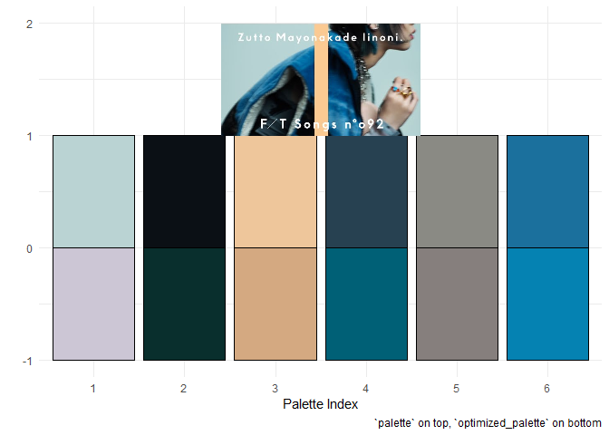
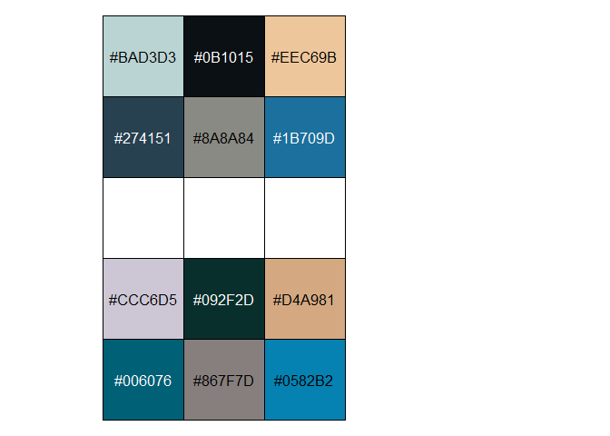

<!-- README.md is generated from README.Rmd. Please edit that file -->

# First Take Palettes

This package provides color palettes based on Sony’s [THE FIRST
TAKE](https://www.youtube.com/channel/UC9zY_E8mcAo_Oq772LEZq8Q) video
series. **This package is not affiliated with Sony Music Entertainment
Japan whatsoever.**

**ftpalsというパッケージのことはSMEやTHE FIRST
TAKEに提携していません。**

Current counts:

| type           |   n |
|:---------------|----:|
| THE FIRST TAKE | 115 |
| THE HOME TAKE  |  16 |

## Goals

I made this as a side project to learn more about working with colors in
R. Specifically I wanted to do the following:

-   Learn more about working with image data in R (but.. not using
    magick)
-   Try to use clustering as a means to make color palettes
-   Try to make those color palettes color blind friendly procedurally

There are packages that provide functionality to create color palettes
from images already, such as
[colorfindr](https://github.com/zumbov2/colorfindr) and
[paletter](https://github.com/AndreaCirilloAC/paletter) but I wanted to
try something new myself.

I reimplemented the genetic algortihm implementation in this paper:

[Troiano, Luigi & Birtolo, Cosimo & Miranda, Maria. (2008). Adapting
palettes to color vision deficiencies by genetic algorithm. GECCO’08:
Proceedings of the 10th Annual Conference on Genetic and Evolutionary
Computation 2008. 1065-1072.
10.1145/1389095.1389291.](https://www.researchgate.net/publication/220740835_Adapting_palettes_to_color_vision_deficiencies_by_genetic_algorithm)

As a result I learned about genetic algorithms using the `GA` package:

[Luca Scrucca (2013). GA: A Package for Genetic Algorithms in R. Journal
of Statistical Software, 53(4),
1-37.](http://www.jstatsoft.org/v53/i04/)

[Luca Scrucca (2017). On some extensions to GA package: hybrid
optimisation, parallelisation and islands evolution. The R Journal, 9/1,
187-206.](https://journal.r-project.org/archive/2017/RJ-2017-008)

I used thumbnails from THE FIRST TAKE’s YouTube uploads as a test case,
as they often have a nice variety of colors from participants’ clothes
and the characteristic bar the studio overlays onto each image. That
said, only videos from THE FIRST TAKE or THE HOME TAKE series were used,
not THE FIRST TAKE FES.

## Documentation

The source files used for scraping the video metadata are available in
the `R/scrape_utils` directory and prepended with `scrape_`. The files
used to implement the genetic algorithm are similarly in `R/GA_utils`
and prepended with `GA_`. Note that these aren’t exported by the
package, but they’re available to look at.

I won’t strongly commit to the actual effectiveness of every palette,
but I think some turned out nice!

## Installation

You can install the released version of `ftpals` from github with:

``` r
devtools::install_github("tsostarics/ftpals")
```

# Palette Examples

All palettes are provided by the `ftpals::first_takes` table. This
provides additional metadata such as `videoId`, `artist` name, and
`song` title. Note that some artist/song names are given in Japanese
while some are given in Romaji, this is just how the data got scraped.
It seems like if an English translation is provided for a video, then
download requests from the United States will pull the translation
instead of the original Japanese.

`show_pals(i)` will show the two palettes available for a given index in
the `first_takes` table. The original sampling of colors,
`first_takes$palette`, is shown on top, and the “optimized” palette,
`first_takes$optimized_palette`, is shown on the bottom for comparison.
The “optimized” palette should be a little better for those with
colorblindness, but effectiveness varies by palette. Due to the
implementation the optimized palette tends to have these qualities:

-   The first color is less white than the original sample
-   The second color is less black than the original sample
-   The palette is **reordered by alternating luminance**, so the hue
    ordering sometimes changes
-   The palette is often somewhat less saturated than the original
    palette

Here is an example from [this
video.](https://www.youtube.com/watch?v=Wdll9P9icJU) You can use the
`plot_ftpalette()` function to plot the palettes with the thumbnail the
colors were sampled from. Or, you can use `show_pals` to see the two
palettes with their hex codes.

``` r
library(ftpals)
library(ggplot2)
plot_ftpalette(91, show_thumbnail = T, use_theme = ggplot2::theme_minimal)
```



``` r
show_pals(91) # 病身を噛む by ずっと真夜中でいいのに
```



Here are a few other examples.

``` r
show_pals(27) # ミカヅキ by さユり
```


``` r
show_pals(42) # sabotage by 緑黄色社会
```


``` r
show_pals(23) # BL by QUEEN-BEE
```


``` r
show_pals(take = 86) # オーケストラ by AiNA THE END
```


Here’s an example with a plot. You can pick the palette you want by
directly indexing the palette or optimized palette you want. Notice
there’s also a `bar_color` column you can access for an additional
highlight color (it tends to be a very saturated color).

``` r
diamonds %>% 
  ggplot(aes(x = cut, y = carat, fill = cut)) +
  stat_summary(fun = 'mean',
               geom = 'bar',
               color = 'black') +
  scale_fill_manual(values = first_takes$optimized_palette[[23]]) +
  geom_hline(yintercept = .75,
             size = 2, 
             linetype = "dashed", 
             color = first_takes$bar_color[[23]]) +
  theme_minimal()
```


## Scale\_ functions

You can use `scale_fill_ftake()` and `scale_color_ftake()` to set
colors, too. They take either an `index`, or a `type` character denoting
which series of videos to use and a `take` for which specific video to
use. If you want to use palettes from THE HOME TAKE, you should opt for
the type/take method. If you want to use videos from THE FIRST TAKE,
index works fine but there is no video number 70 (either it was
accidentally skipped or later taken down), so the index-take number
correspondence is off by one after 69.

``` r
diamonds %>% 
  ggplot(aes(x = cut, y = carat, fill = cut)) +
  stat_summary(fun = 'mean',
               geom = 'bar',
               color = 'black') +
  scale_fill_ftake(index = 24) +
  geom_hline(yintercept = .75,
             size = 2, 
             linetype = "dashed", 
             color = barcolor(24)) +
  theme_minimal()
```


``` r
diamonds %>% 
  ggplot(aes(x = cut, y = carat, fill = cut)) +
  stat_summary(fun = 'mean',
               geom = 'bar',
               color = 'black') +
  scale_fill_ftake(index = 24, order = 6:1) +
  geom_hline(yintercept = .75,
             size = 2, 
             linetype = "dashed", 
             color = barcolor(24)) +
  theme_minimal()
```


``` r
diamonds %>% 
  ggplot(aes(x = cut, y = carat, fill = cut)) +
  stat_summary(fun = 'mean',
               geom = 'bar',
               color = 'black') +
  scale_fill_ftake(palette = 2, type = "H", take = 10) +
  geom_hline(yintercept = .75,
             size = 2, 
             linetype = "dashed", 
             color = barcolor(type = "H", take = 10)) +
  theme_minimal()
```


